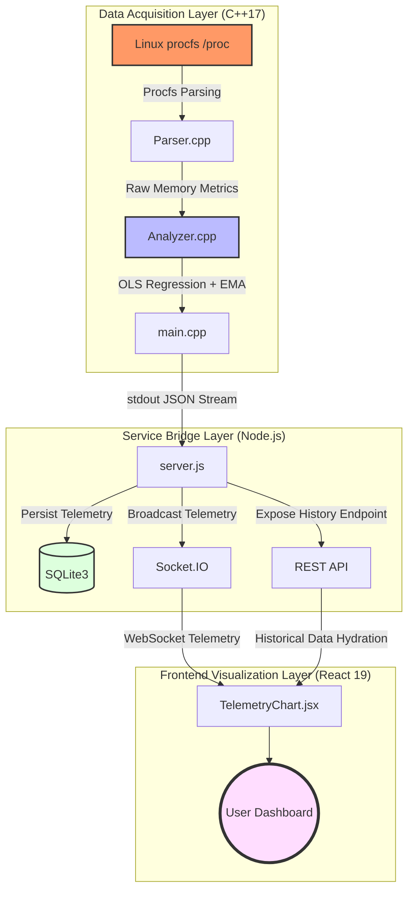

# Low-Level Design

```mermaid
graph TD
    subgraph "Data Acquisition Layer (C++17)"
        PROC[Linux procfs /proc]
        PARSER[Parser.cpp]
        ANALYZER[Analyzer.cpp]
        MAIN[main.cpp]

        PROC -->|Procfs Parsing| PARSER
        PARSER -->|Raw Memory Metrics| ANALYZER
        ANALYZER -->|OLS Regression + EMA| MAIN
    end

    subgraph "Service Bridge Layer (Node.js)"
        SERVER[server.js]
        SQLITE[(SQLite3)]
        REST[REST API]
        WS[Socket.IO]

        SERVER -->|Persist Telemetry| SQLITE
        SERVER -->|Expose History Endpoint| REST
        SERVER -->|Broadcast Telemetry| WS
    end

    subgraph "Frontend Visualization Layer (React 19)"
        CHART[TelemetryChart.jsx]
        DASHBOARD((User Dashboard))

        CHART --> DASHBOARD
    end

    MAIN -->|stdout JSON Stream| SERVER
    WS -->|WebSocket Telemetry| CHART
    REST -->|Historical Data Hydration| CHART

    style PROC fill:#f96,stroke:#333,stroke-width:2px
    style ANALYZER fill:#bbf,stroke:#333,stroke-width:2px
    style SQLITE fill:#dfd,stroke:#333,stroke-width:2px
    style DASHBOARD fill:#fdf,stroke:#333,stroke-width:4px
```