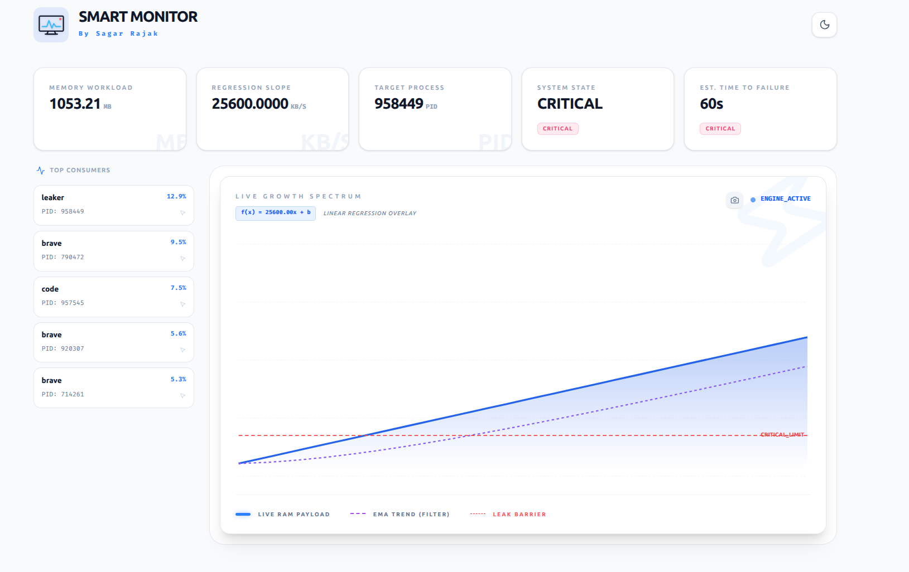

# Smart Monitor

Smart Monitor is a full-stack Linux observability tool designed to track process memory usage in real time and estimate potential Out-of-Memory (OOM) conditions using statistical trend analysis.

The system combines a high-performance C++ telemetry engine, a Node.js orchestration layer, and a React-based live dashboard for visualization and monitoring.

---

# Screenshot

<p align="center">
  
</p>

---


# Architecture Flow

```text
[ Linux procfs (/proc) ]
            ↓
     [ C++17 Engine ]
            ↓ stdout JSON stream
     [ Node.js Bridge ]
        ↙           ↘
 [ SQLite3 ]     [ Socket.IO ]
                        ↓
              [ React Dashboard ]
```
---


# [Low-Level Design (LLD)](./Documentation/LLD.md)

<p align="center">
  
</p>


---

# Features

- Real-time Linux process memory monitoring
- `/proc` filesystem telemetry scraping
- OLS Linear Regression for memory growth estimation
- Exponential Moving Average (EMA) smoothing
- Time-to-Failure (TTF) projection
- Real-time dashboard updates using `Socket.IO`
- Historical telemetry persistence using SQLite
- Layered observability pipeline architecture

---

# Tech Stack

| Layer | Technology |
|---|---|
| Telemetry Engine | C++17 |
| Backend Bridge | Node.js |
| Frontend | React 19 + Vite |
| Persistence | SQLite3 |
| Real-time Transport | `Socket.IO` |
| Styling | Tailwind CSS |
| Telemetry Source | Linux procfs (`/proc`) |

---

# Technical Architecture

The project follows a layered architecture where each component is isolated by responsibility.

## Components

### Engine (`C++17`)

High-performance telemetry engine responsible for:

- Parsing Linux `/proc` memory statistics
- Collecting process-level metrics
- Computing OLS regression slopes
- Streaming telemetry as JSON through stdout pipes

### Bridge (`Node.js`)

Backend orchestration layer responsible for:

- Managing the C++ engine lifecycle
- Processing telemetry streams
- Computing Time-to-Failure estimates
- Persisting historical data into SQLite
- Broadcasting real-time updates using `Socket.IO`

### Dashboard (`React 19 + Vite`)

Frontend visualization layer responsible for:

- Rendering real-time telemetry charts
- Displaying predictive system status
- Hydrating historical telemetry
- Live `Socket.IO` synchronization

---

# Directory Structure

```text
├── engine/         # C++17 telemetry engine
├── bridge/         # Node.js backend orchestrator
├── dashboard/      # React dashboard UI
└── Documentation/  # Technical notes and screenshots
```

---

# Mathematical Foundation

## 1. OLS Linear Regression

The engine estimates memory growth rate using Ordinary Least Squares regression.

$$
m = \frac{n\sum(xy) - \sum x \sum y}{n\sum(x^2) - (\sum x)^2}
$$

Where:

- `m` = memory growth slope
- `x` = sample timestamp
- `y` = memory usage value
- `n` = number of samples

## 2. Exponential Moving Average (EMA)

EMA smoothing is applied to reduce noise in telemetry streams.

$$
EMA_t = \alpha \cdot Value_t + (1 - \alpha) \cdot EMA_{t-1}
$$

Where:

- `EMA_t` = current smoothed value
- `Value_t` = current telemetry sample
- `α` = smoothing factor

## 3. Time-to-Failure (TTF)

Projected time remaining before memory exhaustion.

$$
TTF_{seconds} = \frac{AvailableRAM_{KB}}{GrowthSlope_{KB/s}}
$$

Where:

- `AvailableRAM_KB` = currently available physical memory
- `GrowthSlope_KB/s` = estimated memory growth rate


---

# Installation & Setup

## Prerequisites

- Linux (Ubuntu 20.04+ recommended)
- `g++` with C++17 support
- Node.js v18+
- SQLite3
- Docker & Docker Compose (optional)

---

# Docker Deployment

## 1. Clone Repository

```bash
git clone https://github.com/Sagarrajak01/smart-monitor.git
cd smart-monitor
```

## 2. Build and Start Containers

```bash
docker compose up -d --build
```
The interactive dashboard is instantly available at: http://localhost:3000
<<<<<<< Updated upstream

=======
>>>>>>> Stashed changes
Stop the monitor: `docker compose down`


---

# Native Development Setup

## 1. Build the C++ Engine

```bash
cd engine
make
```

---

## 2. Configure Backend Environment

Create a `.env` file inside `/bridge`:

```bash
cd ../bridge
touch .env
```

Add:

```env
PORT=3000
```

---

## 3. Start Backend Server

```bash
npm install
node server.js
```

---

## 4. Configure Frontend Environment

Open a new terminal:

```bash
cd ../dashboard
touch .env
```

Add:

```env
VITE_SOCKET_URL=http://localhost:3000
```

---

## 5. Launch Frontend

```bash
npm install
npm run dev
```

---

# Performance Notes

- Native telemetry collection implemented in C++17
- Low-overhead `/proc` parsing
- Rolling-window statistical analysis
- Real-time `Socket.IO` streaming architecture
- SQLite-backed historical persistence

---


# Documentation

The **[Documentation](https://github.com/Sagarrajak01/smart-monitor/tree/main/Documentation)** directory contains day-wise engineering logs documenting the evolution of the project architecture.

---


# License

MIT License

Copyright (c) 2026 Sagar Rajak
